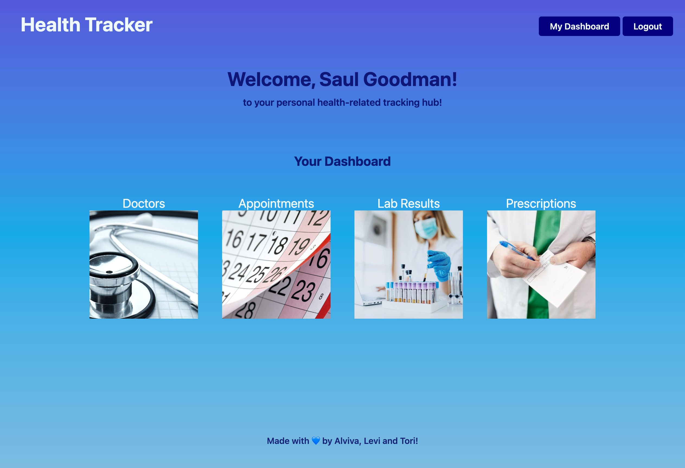

# Health Tracker

## Description
Welcome to your personal Health Tracker! This application allows users to that keeps track of essential health care information. Users are able to log their upcoming appointments, doctors, lab results, and prescriptions. This app will help users keep their healthcare information in one convenient spot. 

## User story
```
AS a person that values my health, I WANT to keep a record of my healthcare information in a single application SO THAT I can easily view my prescriptions, lab results, appointments and other medical information. 
```

## Features

- Personalized dashboard with links to appointments, doctors, lab results, and prescriptions
- Appointments page featuring appointment cards including the date, time, and doctor
    - Reader friendly calendar showing appointment dates
    - Create appointment function 
    - Delete button for each appointment
- Doctors page featuring individual doctors, their specialty, and office location
    - Add doctor function 
    - Delete button for each doctor
- Lab results page featuring the lab name, value, value range (above normal, normal, below normal), and the associated doctor
    - Add lab result function
    - Delete button for each lab result
- Prescription page featuring prescription name, recommended dose, frequency, and the prescribing doctor
    - Add prescription function 
    - Delete button for each prescription


## Applications
* Node.js
* Express
* Express-session
* MySQL
* Sequelize
* Handlebars
* Bcrypt
* Nanoid
* FullCalendar
* Javascript
* CSS


## Mock Up

 
 

## Heroku Deployed link
https://evening-reef-97935.herokuapp.com/

## Future Developments
- Notification system for scheduling appointments at the recommended times
- Uploading feature for PDF files (vaccination and lab results) 
- Map and directions to doctor’s offices
- Separate doctor login for doctor use
- Additional security due to the content of our application


 ## Developers
 Alviva Faidley, Levi Heintzelman, and Tori Haling